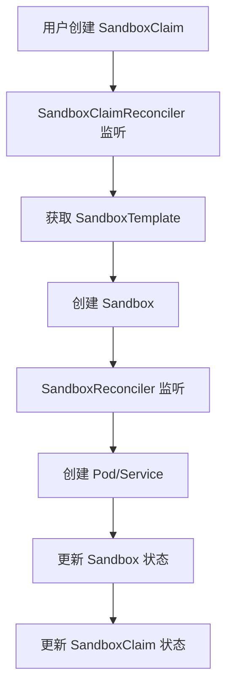
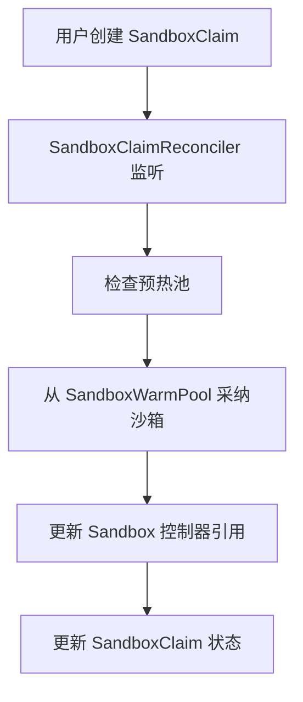
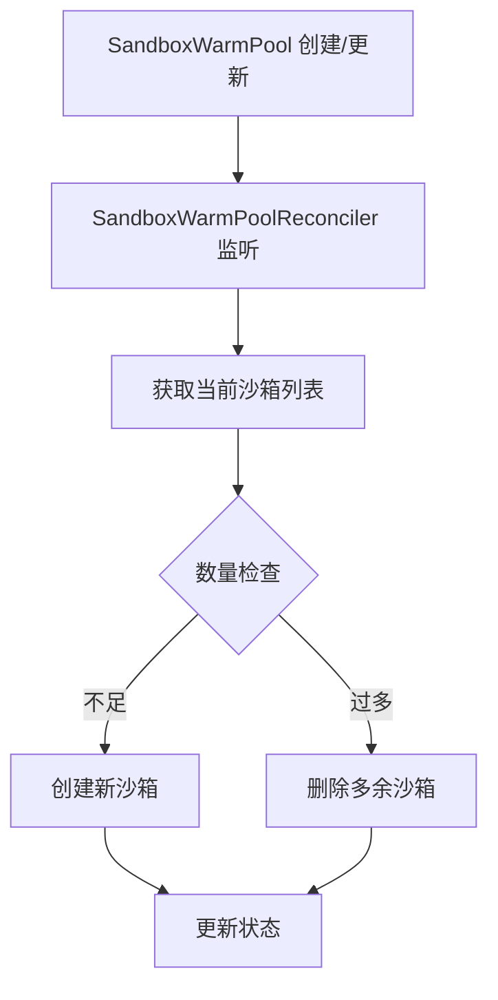

# Agent Sandbox 代码仓分析

## 1. 项目概览

Agent Sandbox 是一个 Kubernetes 原生的沙箱管理系统，提供安全、隔离的运行环境，支持快速创建和管理沙箱实例。

### 核心功能
- **沙箱生命周期管理**：创建、运行、监控、销毁沙箱
- **预热池机制**：提前准备沙箱，减少启动延迟
- **模板管理**：通过模板标准化沙箱配置
- **网络隔离**：内置网络策略支持
- **多语言客户端**：Go 和 Python 客户端
- **可观测性**：指标和追踪支持

## 2. 目录结构

```
├── api/                # 核心 API 定义
│   └── v1alpha1/       # Sandbox CRD 定义
├── clients/            # 客户端库
│   ├── k8s/           # Go 客户端
│   └── python/        # Python 客户端
├── cmd/               # 命令行工具
│   └── agent-sandbox-controller/  # 控制器主入口
├── controllers/        # 核心控制器
├── extensions/         # 扩展功能
│   ├── api/           # 扩展 API 定义
│   └── controllers/   # 扩展控制器
├── internal/           # 内部工具
│   └── metrics/        # 指标和追踪
├── k8s/               # 部署配置
├── examples/           # 示例
└── test/               # 测试
```

## 3. 核心组件

### 3.1 自定义资源 (CRD)

| 资源 | 定义文件 | 说明 |
|------|---------|------|
| Sandbox | api/v1alpha1/sandbox_types.go | 核心沙箱资源，定义运行环境 |
| SandboxTemplate | extensions/api/v1alpha1/sandboxtemplate_types.go | 沙箱模板，定义配置标准 |
| SandboxClaim | extensions/api/v1alpha1/sandboxclaim_types.go | 沙箱声明，动态请求沙箱 |
| SandboxWarmPool | extensions/api/v1alpha1/sandboxwarmpool_types.go | 沙箱预热池，维护预热实例 |

### 3.2 控制器

| 控制器 | 文件 | 职责 |
|--------|------|------|
| SandboxReconciler | controllers/sandbox_controller.go | 管理 Sandbox 生命周期 |
| SandboxClaimReconciler | extensions/controllers/sandboxclaim_controller.go | 管理沙箱声明和资源分配 |
| SandboxTemplateReconciler | extensions/controllers/sandboxtemplate_controller.go | 管理沙箱模板 |
| SandboxWarmPoolReconciler | extensions/controllers/sandboxwarmpool_controller.go | 管理预热池 |

### 3.3 客户端

| 客户端 | 目录 | 功能 |
|--------|------|------|
| Go 客户端 | clients/k8s/ | Kubernetes 客户端库 |
| Python 客户端 | clients/python/agentic-sandbox-client/ | 高级沙箱管理客户端 |

## 4. 依赖调用流程

### 4.1 沙箱创建流程（无预热）



### 4.2 沙箱创建流程（使用预热池）



### 4.3 预热池管理流程



## 5. 核心功能实现

### 5.1 沙箱管理

**文件**: controllers/sandbox_controller.go

- **Reconcile 方法**: 处理沙箱生命周期
- **reconcileChildResources**: 管理 Pod、Service、PVC
- **handleSandboxExpiry**: 处理沙箱过期
- **SetupWithManager**: 设置控制器监听

### 5.2 沙箱声明管理

**文件**: extensions/controllers/sandboxclaim_controller.go

- **getOrCreateSandbox**: 从预热池采纳或创建沙箱
- **reconcileNetworkPolicy**: 管理网络策略
- **computeAndSetStatus**: 更新声明状态

### 5.3 预热池管理

**文件**: extensions/controllers/sandboxwarmpool_controller.go

- **reconcile**: 管理预热沙箱数量
- **scaleUp**: 增加预热沙箱
- **scaleDown**: 减少预热沙箱
- **adoptSandbox**: 采纳无主沙箱

### 5.4 Python 客户端

**文件**: clients/python/agentic-sandbox-client/k8s_agent_sandbox/sandbox_client.py

- **SandboxClient**: 高级沙箱管理客户端
- **_create_claim**: 创建沙箱声明
- **run**: 执行命令
- **write/read**: 文件操作

## 6. API 接口

### 6.1 Sandbox API

**主要字段**:
- `spec.podTemplate`: Pod 配置
- `spec.volumeClaimTemplates`: PVC 模板
- `spec.lifecycle`: 生命周期管理
- `status.conditions`: 状态条件

### 6.2 SandboxTemplate API

**主要字段**:
- `spec.podTemplate`: Pod 模板
- `spec.networkPolicy`: 网络策略
- `spec.networkPolicyManagement`: 网络策略管理模式

### 6.3 SandboxClaim API

**主要字段**:
- `spec.sandboxTemplateRef`: 模板引用
- `spec.lifecycle`: 生命周期配置
- `status.sandbox`: 关联沙箱信息

### 6.4 SandboxWarmPool API

**主要字段**:
- `spec.replicas`: 预热数量
- `spec.sandboxTemplateRef`: 模板引用
- `status.readyReplicas`: 就绪数量

## 7. 配置与部署

### 7.1 部署组件

| 组件 | 配置文件 | 说明 |
|------|---------|------|
| 核心控制器 | k8s/controller.yaml | 部署 Sandbox 控制器 |
| 扩展控制器 | k8s/extensions.controller.yaml | 部署扩展控制器 |
| CRD | k8s/crds/ | 自定义资源定义 |
| RBAC | k8s/rbac.generated.yaml | 权限配置 |

### 7.2 环境变量与参数

**控制器参数**:
- `--metrics-bind-address`: 指标端口
- `--health-probe-bind-address`: 健康检查端口
- `--leader-elect`: 领导者选举
- `--extensions`: 启用扩展控制器
- `--sandbox-concurrent-workers`: 沙箱并发工作线程

## 8. 监控与可观测性

### 8.1 指标

**文件**: internal/metrics/metrics.go

- `SandboxClaimCreationTotal`: 沙箱声明创建总数
- `SandboxReadyDuration`: 沙箱就绪时间
- `SandboxClaimAdoptionTotal`: 从预热池采纳的沙箱数

### 8.2 追踪

**文件**: internal/metrics/tracing.go

- OpenTelemetry 集成
- 支持 GCP 追踪

## 9. 示例与使用

### 9.1 基本用法

**创建沙箱模板**:
```yaml
apiVersion: agents.x-k8s.io/v1alpha1
kind: SandboxTemplate
metadata:
  name: python-sandbox-template
spec:
  podTemplate:
    spec:
      containers:
      - name: sandbox
        image: python-runtime:latest
```

**创建预热池**:
```yaml
apiVersion: agents.x-k8s.io/v1alpha1
kind: SandboxWarmPool
metadata:
  name: python-warm-pool
spec:
  replicas: 3
  sandboxTemplateRef:
    name: python-sandbox-template
```

**请求沙箱**:
```yaml
apiVersion: agents.x-k8s.io/v1alpha1
kind: SandboxClaim
metadata:
  name: my-sandbox
spec:
  sandboxTemplateRef:
    name: python-sandbox-template
  lifecycle:
    shutdownTime: "2025-01-01T12:00:00Z"
```

### 9.2 Python 客户端

```python
from k8s_agent_sandbox import SandboxClient

with SandboxClient(
    template_name="python-sandbox-template",
    namespace="default"
) as sandbox:
    result = sandbox.run("echo 'Hello World'")
    print(result.stdout)
```

## 10. 测试与开发

### 10.1 测试类型

| 测试 | 目录 | 说明 |
|------|------|------|
| 单元测试 | controllers/*_test.go | 控制器单元测试 |
| 端到端测试 | test/e2e/ | 完整流程测试 |
| 负载测试 | dev/load-test/ | 性能测试 |

### 10.2 开发工具

- **Makefile**: 构建和测试命令
- **dev/tools/**: 开发工具脚本
- **codegen.go**: 代码生成配置

## 11. 架构设计亮点

1. **声明式 API**: 使用 Kubernetes 自定义资源
2. **预热池机制**: 大幅减少沙箱启动时间
3. **模板标准化**: 确保配置一致性
4. **网络隔离**: 内置安全策略
5. **多语言支持**: Go 和 Python 客户端
6. **可观测性**: 完善的指标和追踪
7. **扩展性**: 模块化设计，易于扩展

## 12. 依赖关系

| 组件 | 依赖 | 用途 |
|------|------|------|
| 控制器 | controller-runtime | 控制器运行时库 |
| 客户端 | client-go | Kubernetes 客户端 |
| Python 客户端 | requests, kubernetes | API 调用 |
| 监控 | prometheus | 指标收集 |
| 追踪 | opentelemetry | 分布式追踪 |

## 13. 总结

Agent Sandbox 是一个功能完整的 Kubernetes 沙箱管理系统，通过声明式 API、预热池机制和标准化模板，提供了高效、安全的沙箱环境管理能力。其核心价值在于：

- **快速启动**: 预热池机制大幅减少沙箱启动时间
- **标准化配置**: 通过模板确保配置一致性
- **安全隔离**: 内置网络策略支持
- **易于使用**: 提供高级 Python 客户端
- **可观测性**: 完善的监控和追踪

该项目为需要隔离运行环境的场景（如 AI 模型推理、安全测试、开发环境）提供了理想的解决方案。

## 为什么要设计Agent Sandbox
Kubernetes 已经采用容器进行应用的隔离，但在 AI Agent 场景里面，仅靠容器的隔离是不够的。

容器会共享宿主机内核，一旦某个容器中的恶意代码找到内核漏洞，就可以突破容器边界，访问宿主机或其他容器的数据，也就是有容器逃逸风险。
对于传统应用来说，这个风险是可控的。代码是开发者编写的，经过了层层测试和审核，可以假定它是可信的。

但 AI Agent 场景完全不同。AI Agent 生成的代码是实时的、动态的，没有经过任何审核流程。它可能写出完全正常的数据分析脚本，也可能不小心生成访问敏感文件的命令。开发者无法提前知道它会做什么。而且一个 AI 应用可能同时服务数千个用户，每个用户的请求都需要一个独立的沙箱环境。这意味着需要在几秒钟内创建和销毁数千个沙箱，而且每个沙箱都必须确保严格隔离。

还有个问题是网络隔离的粒度。AI Agent 可能需要访问外部 API 来完成任务，但又不希望它随意访问内网资源或者向外传输敏感数据。传统容器的网络隔离粒度不够细，很难做到精确控制。

Google 在发布 Agent Sandbox 时明确表示：为 AI Agent 提供内核级隔离是非协商的需求（non-negotiable）。这不是过度设计，而是 AI 时代基础设施的刚需。

## Agent SandBox的设计目标是什么
### 1. 强隔离 + 高性能：技术实现揭秘
Agent Sandbox 的核心挑战是：如何在保证强隔离的同时，还能做到快速启动？

隔离层：gVisor 和 Kata Containers
Agent Sandbox 底层支持两种隔离技术：gVisor 和 Kata Containers。

gVisor 是 Google 开源的一个“用户态内核”。传统容器直接调用宿主机内核，而 gVisor 在中间加了一层。容器的系统调用先经过 gVisor 处理，gVisor 再决定是否转发给真正的内核。即使恶意代码找到了内核漏洞，它攻击的也是 gVisor 这层防护，而不是真正的内核。

Kata Containers 则采用了另一种思路：为每个容器创建一个轻量级虚拟机。虚拟机有自己独立的内核，跟宿主机完全隔离。这种隔离级别更高，但启动速度相对慢一些。

Agent Sandbox 同时支持这两种技术，用户可以根据自己的安全需求选择。在 GKE（Google Kubernetes Engine）上，Google 还提供了托管的 GKE Sandbox，底层用的就是 gVisor。不需要自己维护 gVisor，直接用就行。

### 2.性能优化：从分钟到亚秒
光有强隔离还不够，AI Agent 场景对性能的要求也很高。用户发了个请求，等了 2 分钟才看到沙箱启动完成，体验肯定很差。
Agent Sandbox 用了两个关键技术来解决启动速度问题。
预热池（Warm Pool）
预热池的思路很简单。提前创建好一批沙箱，放在“池子”里待命。当用户发起请求时，直接从池子里拿一个现成的沙箱，用完再放回池子。

通过预热池，Agent Sandbox 可以把启动延迟降到亚秒级，相比冷启动提升了 90%。

快照恢复（Pod Snapshots）这是 GKE 独家提供的功能。

可以把一个运行中的 Pod 完整地拍个快照，保存它的内存状态、文件系统、进程信息等等。之后需要恢复时，直接从快照启动，几秒钟就能回到之前的运行状态。这个功能特别有用。把 Python 环境、依赖库都装好，拍个快照，之后每次启动直接用快照，省掉了漫长的 pip install 过程。用户暂时不用沙箱时，拍快照然后销毁 Pod，节省计算资源。用户回来时，从快照恢复，几乎感觉不到中断。

Pod Snapshots 不仅支持 CPU 工作负载，还支持 GPU 工作负载。对于需要 GPU 的 AI 推理任务，可以把模型加载到 GPU 后拍快照，下次启动直接跳过模型加载阶段。

根据 Google 的测试数据，传统容器冷启动需要 10-30 秒，资源占用中等。Agent Sandbox 配合 Warm Pool 启动时间小于 1 秒，但池子会预占用一些资源。Agent Sandbox 配合 Pod Snapshots 启动时间 2-5 秒，空闲时不占资源。

Warm Pool 和 Pod Snapshots 适用于不同场景。高并发场景用 Warm Pool，牺牲一些资源换取极致速度。成本敏感场景用 Pod Snapshots，启动慢几秒，但空闲时不占资源。